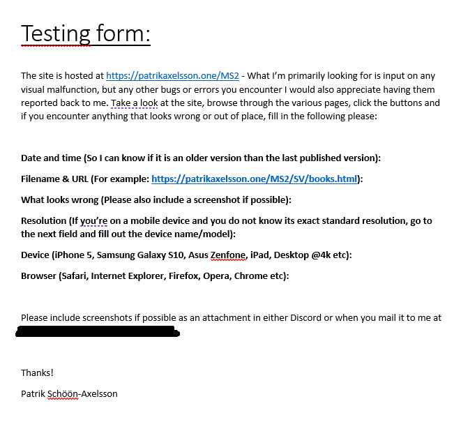

# Code Institute Milestone 2
## Interactive Frontend Development

A project using public APIs from google and EmailJS to produce a website for an author. Both english and swedish versions of the site are available. The site is hosted [here](https://www.patrikaxelsson.one/MS2/index.html).

## Table of contents:

#### 1) Introduction

##### 1.1) UX design & User stories
#### 1.1.1) User stories
##### 1.2) Wireframes
##### 1.3) Features
##### 1.4) What to add in the future?

#### 2) Testing

##### 2.1) Why not Jasmine-tested?
##### 2.2) Manual testing
###### 2.2.1) Display/Layout testing
###### 2.2.2) Google Maps
###### 2.2.3) Google Calendar
###### 2.2.4) EmailJS
###### 2.2.5) Validation
###### 2.2.6) Peer review

##### 3) Deployment and installation

##### 3.1) Deployment
##### 3.2) Installation

#### 4) Technologies used

### 1) Introduction

This project uses jQuery and Bootstrap for an authors website. Majgull Axelsson is a swedish author and a family member of mine. I have worked at the family company handling social media and general IT in the past. Majgull has decided she does not want a social media presence, but a website to present her work and offer an easy means of contact with her readers and events-bookers is still advantageous to her career and the family business.

#### 1.1) UX design & User stories

The site is intended to facilitate contact between the author and reader, allowing visitors to get information about the authors books and allowing the author to publicize their upcoming events such as lectures, book-signings etc. While building interest in the reading base is important, the author herself prefers to focus on her writing and thus a full on social-media integration is not beneficial here. On the other hand, the site does provide access to the Goodreads community site, meaning interaction about the media presented on the site is made as easy as possible for visitors.

#### 1.1.1) User stories

-- Someone looking to book a lecture could contact the author using the contact page.
-- Someone looking for information about the authors books in English could use the english-mirror side of the site.
-- Someone who wants to see upcoming events can see them clearly sorted immediately at the start page and use the integrations with google calendar and google maps to find more       information about upconing events and their location.
-- The author can use it to publish information about upcoming events in an easy-to-access format for their fans
-- The author can have a single, simple way to communicate with fans without the distractions of maintaining a full social media presence
-- The author can direct fans wishing to discuss their work to the Goodreads community, providing social media and discussion about the books

#### 1.2) Wireframes

The wireframes for the pages in the project can be found [here](wireframes/Wireframes-Milestone-2-New.pdf).
Late in the project, the language-toggle was redesigned. For completeness, I include the earlier version of the wireframes [here](wireframes/Wireframes-Milestone-2.pdf).

#### 1.3) Features

Functional system for registering and displaying calendar events with directions to locations.

Bilingual content. The author is published in multiple languages, so an international option in English is available.

Information on all published novels by the author, including links for further discussion on social media.

Functional contact method for contacting the author.

#### 1.4) What to add in the future?

A proper content management system. Wordpress was considered, but in the end I decided to hold off and wait until I can see if there are better options that are less restrictive.
An admin page allowing admins to add events directly to the calendar through the API.

### 2.0) Testing

The testing conducted on this project was done manually on a variety of screens, browsers and resolutions. Details can be found in section 2.2. Before then, I thought it was worth mentioning why the choice was made not to test using the Jasmine framework.

#### 2.1) Why not Jasmine-tested?

The choice was made to test manually early in the process, based on the prototypes of the scripts needed. The primary way JavaScript is used in the project is to make AJAX calls to APIs, then manipulating the response and using it to update the DOM. Essentially, the thing to test for is thus reduced to A) Did I get the correct data from the server? and B) Did I manage to use this data as intended in the project? Considering the simple logic of those questions, automated testing felt superfluous for this particular assignment. Similarily, main.JS is mainly concerned with graphical effects and UI which requires a manual approach to ensure the visuals function properly.

In the future, when producing code with more complex logic, I will definitely implement automatic testing but for the moment it felt like a needless distraction.

#### 2.2) Manual testing

I began during the design-phase to plan how to test the project. The original plan was to incorporate EmailJS for sending email from the contact page, using the Google Calendars and Google Maps API for listing events and printing directions and finally to include functionality from the Goodreads API.
Unfortunately [Goodreads API disallows CORS](https://www.goodreads.com/Topic/17893514/comments?subject=17893514) and while there are examples on Stack Overflow of people having gotten it working through back-end methods, neither github pages nor my own host for the project allows the kind of back-end control required.

Once the scope had narrowed to include EmailJS and two of the google APIs, my second thought became safety measures. I created a file named config.js and marked it with gitignore. I then further restricted the API keys contained therein to only function when called from a domain I control and own. The environment variables in config.js are listed in section 3.2.

##### 2.2.1) Display/Layout testing

I involved about fifteen people in testing the page on multiple screens. Each tester was given a small form to fill in, noting the device they were using and any display errors they ran into. A number of changes were implemented after I had gone through the feedback. Cosmetic changes were made primarily to things such as the way links were highlighted, the mouseover event having in earlier designs lead to jerky and jarring animations in the navbar.

Towards the end of the process, a bug was encountered in index.html using responsinator. The RGBA backdrop did not fill the entire background in landscape mode. It was resolved by changing the "height" on the relevant CSS rule that applied the RGBA style to min-height.

##### 2.2.2) Google Maps

The project only uses Google Maps API in a small way. When registering an event on the google calendar, one can mark the location on a google maps object. This object is also available inside the event-item in the calendar item itself. However, if there is an API call sent to the Google Calendar, the location returned is in the format of a string with the street adress.

The script loadCalEvents.js url-encodes this string and combines with a base directions-API URI to create an instant link with directions for any event-location.

##### 2.2.3) Google Calendar

loadCalEvents.JS makes two calls to the google calendar server each time its executed. It uses the list-method first to acquire a date-sorted list of upcoming events from the Calendar.  It then iterates through this list, sending back a request to google calendar for the specifics of that event, before packaging the response in an event-listing on start.html.

Specifically during the testing of this process, I ran into the trouble of the returned items being events that had already passed. It now passes a timestamp of the current time with the AJAX-call and ignores any event older than the present time the script is executed. 

##### 2.2.4) EmailJS

EmailJS was installed in accordance with their manual [here](https://www.emailjs.com/docs/sdk/installation/), specifically the instructions for using it through an external script. While testing, I encountered nothing unforeseen.

##### 2.2.5) Validation

CSS and HTML was validated using the w3c [CSS validator](https://jigsaw.w3.org/css-validator/) and [HTML validator](https://validator.w3.org/). Minor issues were found in earlier versions of the code, in many cases related to using span elements and problems on contact.html with labelling. These were corrected manually. 

JSHint was used to validate the JavaScript components of the code.

##### 2.2.6) Peer review

After submitting the project for peer-review in slack, the following changes were implemented
    
    JS

 * sendMail.js was updated to clear the form after each submission
    
    CSS

 * float:left was removed on smaller screens for the .image-wrap class, as the wrapping effect caused issues with the headers on books.html

    README

 * An image of the form sent out to testers has been attached. See 2.2.1 for details.

   HTML

 * Changes were made to index.html to make the language selection more clear and intuitive. Specifically moving the headers into the two bootstrap columns.

### 3) Deployment and installation

While a mirrored site is up on github-pages, this site was deployed on patrikaxelsson.one before submission. I already owned the domain and server-space, so the decision to host the content there was made to be allowed to pass in a git-ignored config file to the directory, which was apparently not possible on github pages. Hosting it on my own domain also allowed me too keep the API-keys used in the code usable only when called from a domain I controlled.

#### 3.1) Deployment

The deployment was made through the domain-host file-access system, a web based FTP interface for uploading files to the host. A separate folder was created to contain the files and then the entire project folder was uploaded there. 

I then went to the API dashboards for google and EmailJS and entered the URL for my domain as the only viable source for calls using this API key. I tested by launching a simple http server locally using "python -m http.server" and navigated to localhost:8000. A 403 was returned when called locally and 200 when called from the domain, indicating success and that my API key was secure.

#### 3.2) Installation

To install and run the project, you will require a file named "config.js" inside the "/assets/js/" folder of the project. This file must contain API keys for EmailJS and Google Calendar and Maps API. The latter two must also be activated on your google api [dashboard](https://console.developers.google.com/apis/dashboard?pli=1) and preferably secured further by setting your google dashboard to only accept calls from certain URLs. 

config.js must contain the following environment variables

    GCalClient_ID: <Client ID, from the google API dashboard>,
    GCalAPIKey : <API key from the same>,
    GcalendarId : <Google Calendar ID, available from the dashboard but generally the email tied to the calendar>,
    GCalBaseURI : <The URI for your calendar ID in the events section, for more documentation on syntax see: https://developers.google.com/calendar/v3/reference/events >,

    EmailJSKey : <Key for EmailJS, please visit https://www.emailjs.com/ for more details> ,
    EmailJSAT :  <EmailJS access token, available at https://www.emailjs.com/ >,

### 4) Technologies used.

The tool I used to write the code for this project was Visual Studio Code.

A great deal of the javascript used in the project is written using the jQuery framework. Documentation may be found [here](https://api.jquery.com/)

The EmailJS API for sending email is used in contact.html. Documentation for this API can be found [here](https://www.emailjs.com/docs/).

The Google Maps and Calendar APIs are used. More information on these two API services can be found at the following links: [Google Calendar API](https://developers.google.com/calendar/v3/reference) and [Google Maps API](https://developers.google.com/maps/documentation/javascript/tutorial).

General responsive design and grid interface comes from [Bootstrap](https://getbootstrap.com/), a HTML, CSS and JavaScript framework.

Wireframes designed using Balsamiq and exported into PDF.